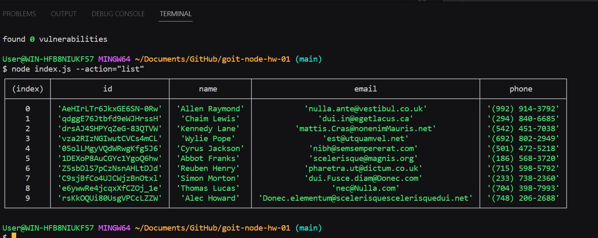
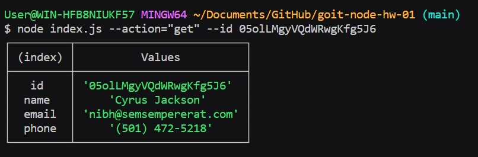
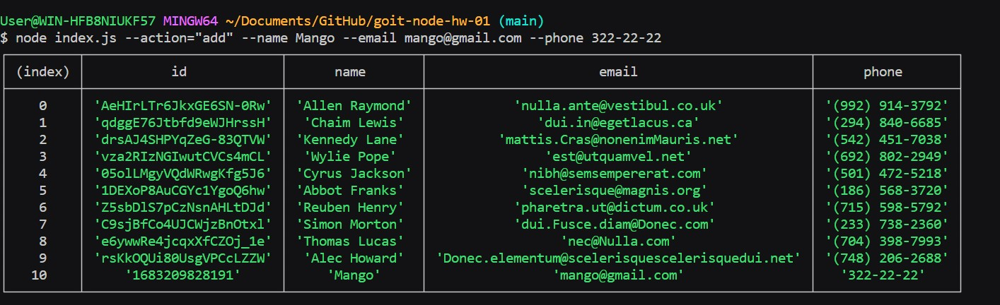
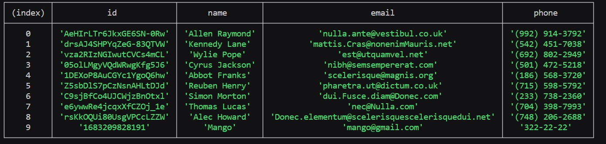

# Node.JS - Command Line Interface

### Action "list"



### Action "get"



### Action "add"



### Action "remove"



---

## Description

_This application is the **contacts manager** for work with your contacts.. You can get all contacts, get contact by id, add contact and remove contact by id._

## Table of Contents

- [Node.JS - Command Line Interface](#nodejs---command-line-interface)
  - [Description](#description)
  - [Table of Contents](#table-of-contents)
  - [Technologies used](#technologies-used)
  - [Install](#install)
  - [Usage](#usage)

## Technologies used

- Node.JS
- Node.JS base module "fs"
- Node.JS base module "path"

## Install

```
$ git clone https://github.com/KovalMaxim1989/goit-node-hw-01.git
$ cd your-project
$ npm install
$ npm start
```

## Usage

```
// Get all contacts
$ node index.js --action list

// Get contact by id
$ node index.js --action get --id 05olLMgyVQdWRwgKfg5J6

// Add contact
$ node index.js --action add --name Mango --email mango@gmail.com --phone 322-22-22

// Remove contact by id
node index.js --action remove --id qdggE76Jtbfd9eWJHrssH

// Get help
node index.js --action help
```
